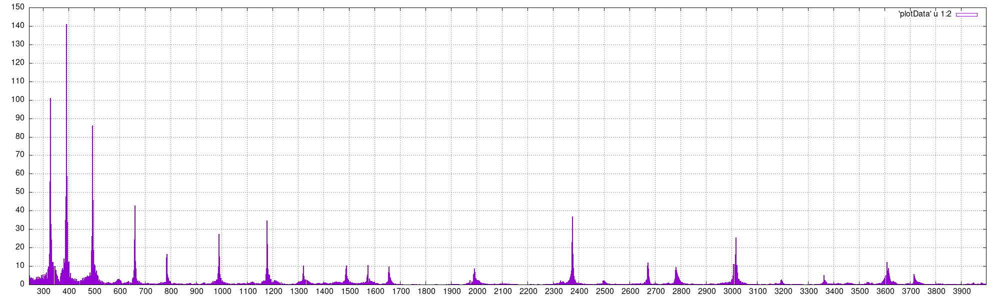
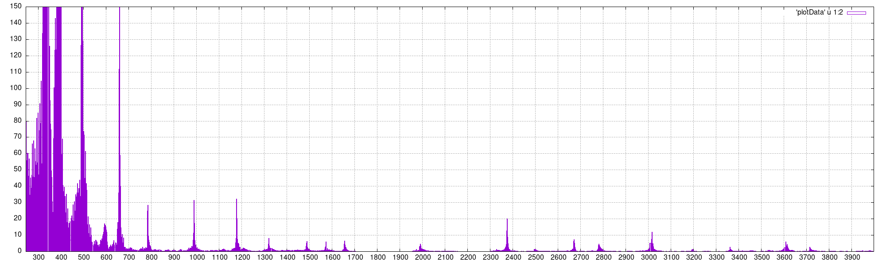
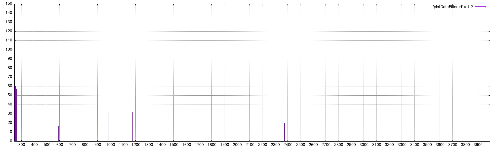
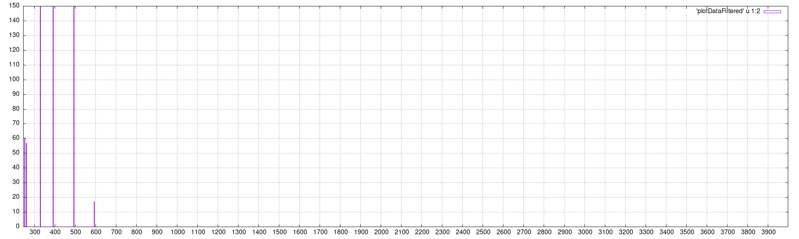

# Summary
This program takes live input from the default microphone, and performs a frequency analysis to recognize the played note on a piano. (Or a direct generated sine wave)
This is a university project for "MUME" under Maximilian Mengel.

[Click here](https://misterixi.github.io/NoteanalyserPreview/) for a rendered Preview of the 3D Model. Alternatively you can visit the [Fusion 360 shared Link](https://a360.co/3uYjknz) to get a manual view of the model file. :)

# Compatibility
This program was designed and tested on a Raspberry Pi 4 (8GB) with Raspbian Lite.
You can probably run this on other Systems, but keep in mind that if you enable the LED or LCD option the program will not run if you are not on an Raspi or don't have an i2c LCD connected.

# Installation
Required Programms:
please install the following programms with your package manager (sudo apt-get install [...])
- make
- cmake
- g++
- gnuplot (optional if you never activate plotting)  

You can install everything at once like so on debian (and raspbian)  
```sudo apt-get install make cmake g++ gnuplot```

After this you can simply run the provided installation script with:  
```sudo ./install_dependencies```  

Note that this script will attempt to download and install every depencies it finds as missing in the system including compiling. It might take a few minutes to run, but afterwards everything should be ready.  
It will create the directory **lib/** which you can delete after running the script since it is only a working directory. The dependencies themselves will be installed to the system accordingly.

To compile the program you now only need to type ```make``` in the parent directory.

# Usage
The Programm features 4 Flags:
- "-S": activates the Screen
- "-L": uses LEDs to output results
- "-G": outputs the results to files and uses gnuplot to graph them into .png
- "-M": Recognize multiple Notes instead of a single one  
  
You can set the defaults of these flags at the top of the "AnalyserDefinitions.h".

# Hardware assembly  
You can find the main assembly instructions [here on prusaprinters.com](https://www.prusaprinters.org/prints/139324-noteanalyser).  
In Short: The whole project was designed with 3M threaded heatinsterts in mind together with 3Mx6 screws. You can use longer screws everywhere except for the LCD screws and the LEDHolder part.

# How it works
Here an example of E4, G4 and B4(/H4) being pressed at the same time. With a too much noise.
1. Recording 0.5s of data from the microphone

2. This is then first scaled to to try and match the offset in loudness of the values

3. Now we filter to only the peaks and try to remove any noise around them.

4. As a last step we remove the overtones.


This is an intentional unclean example to show a few things:
The problem with the hard scaling at the low end introduces a lot of noise. Which in turn makes the further steps more difficult. But we found without the scaling the lower notes often don't get picked up enough, which led to false recognition of the overtones.
Further tweaking of the parameters should alleviate most of these issues.  
Steps 2 and 3 could both use some improvements. Specifically the filter step has trouble with kicking early notes. This also comes from the notes being very close together at the low end.  
In the end this cycle has recognized the correct notes, but the noise also made a few false positives. Which will filter down to two wrong notes in the output (every peak gets matched with the closed frequency of a note, even when that frequency was already "found")

# Autostart
To configure the program to start automatically at boot you have to add the following line to the `/etc/crontab`:  
`@reboot root /home/pi/Noteanalyser/startNoteanalyser &`  
(Of course change the path to the script accordingly) This will call the script which waits for 20 seconds after boot to wait for the intialisation of the microphone. After that it starts the program in the background.